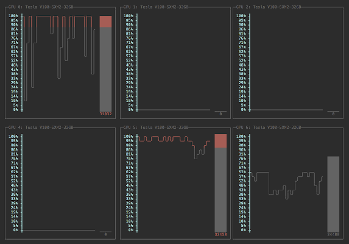

# DGX Tools

DGX tools are a set of tools I've written to make working on the DGX servers more convenient.

## Installation
Clone the repository and run 

```bash
python3 setup.py install
```

Once the installation is complete, the following tools will become available.
 
## GPU Graph
Graphically shows GPU usage through the use of line and bar plots on a given machine.



### Usage
Run GPU Graph by using the command `gpu-graph`.
The update interval, in seconds, can also be changed by using the `-i` flag.
For example,

```bash
gpu-graph -i 0.3  # Set update interval to every 0.3 seconds
```

## Slurm GPU (SGPU)
Details each job in the Slurm queue including their GPU allocations.

The command `squeue` is used to show what jobs are currently in the Slurm queue.
Unfortunately, the job description view shown by it do not include GPU allocations.
This tool provides an easy way to get the GPU usage information in table form as well as showing remaining available resources. 

SGPU will print a table within the terminal window which shows the following information for each job in the slurm queue:

- Job Id
- Job Name
- User who started the slurm job
- Elapsed Time since start
- Start Time of the job
- CPUs assigned to the job
- Memory assigned to the job
- GPUs assigned to the job.

The remaining available resources on the server is also shown.

Additionally, all dgx systems can be check at once with the `-a` flag.

### Usage
Run SGPU by using the command `sgpu`.

Run `sgpu -a` to run the command on all DGX machines at once.

## Container Inspect
Inspect docker containers and view how many GPUs are assigned to them and which user started them.

The command `docker ps` shows the running containers, but do not show the sources assigned to them nor does it show the user who started the container.
Container Inspect solves these issues by generating a table with the following information: 

- Container ID
- Container Name
- User that started the container (this doesn't always succeed as it relies on the workspace that has been mounted)
- Image the container is running
- Index of CPUs used by the container
- Number of CPUs assigned
- Index of GPUs used by the container
- Number of GPUs assigned

### Usage
Run Container Inspect using the command `container-inspect`.


## Attributions
This work uses code from [asciichartpy](https://pypi.org/project/asciichartpy/), licensed under the MIT license.
